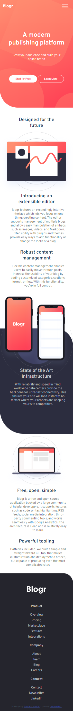
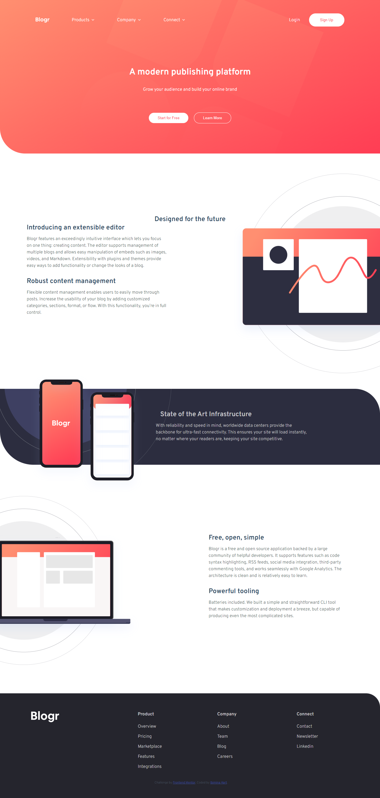

# Frontend Mentor - Blogr landing page solution

This is a solution to the [Blogr landing page challenge on Frontend Mentor](https://www.frontendmentor.io/challenges/blogr-landing-page-EX2RLAApP). Frontend Mentor challenges help you improve your coding skills by building realistic projects. 

## Table of contents

- [Overview](#overview)
  - [The challenge](#the-challenge)
  - [Screenshot](#screenshot)
  - [Links](#links)
- [My process](#my-process)
  - [Built with](#built-with)
  - [Proud of this](#proud-of-this)
  - [Continued development](#continued-development)
- [Author](#author)


## Overview

### The challenge

Users should be able to:

- View the optimal layout for the site depending on their device's screen size
- See hover states for all interactive elements on the page

### Screenshot




### Links

- Solution URL: (https://github.com/ibimina/blogr-landing-page-main)
- Live Site URL: (https://ibimina.githb.io/blogr-page-main)

## My process

### Built with

- Semantic HTML5 markup
- CSS custom properties
- Flexbox
- CSS Grid
- Mobile-first workflow


### Proud of this
The below js snippet used to open the sub navigation and changes the arrow icon when  a navigation link icon is  clicked

```js
 try {
      let arrow = e.target;
      let show = arrow.parentElement.nextElementSibling;
      visibility = show.getAttribute("data-visible");
      console.log("a");
      if (visibility === "false") {
        show.setAttribute("data-visible", true);
        toggle.setAttribute("aria-expanded", true);
      } else {
        show.setAttribute("data-visible", false);
        toggle.setAttribute("aria-expanded", false);
      }
    } catch (error) {
      console.log("click the button");
    }
```

Changes the arrow icon in the y direction
```css
.link-toggle[aria-expanded="true"] {
  transform: scaleY(-1);
}
```
### Continued development

Responsive mobile navigation

## Author

- Ibimina Hart
- Frontend Mentor - (https://www.frontendmentor.io/profile/ibimina)
- Twitter - (https://www.twitter.com/ibiminaa)


